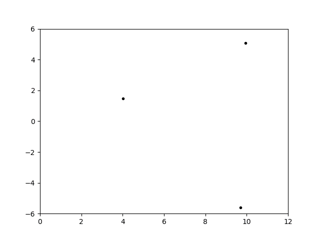

# Track-Oriented Multiple Hypothesis Tracker

This package is not intended to be a silver bullet solution for your tracking application. It may however provide a good starting point to further expand from. See the examples folder for inspiration.

## Installation

You can install this package from [PyPI](https://pypi.org/project/mht/):

    pip3 install mht

## Requirements

- Python3
- Murty algorithm implementation

        git clone --recursive https://github.com/erikbohnsack/murty.git
        pip3 install ./murty
